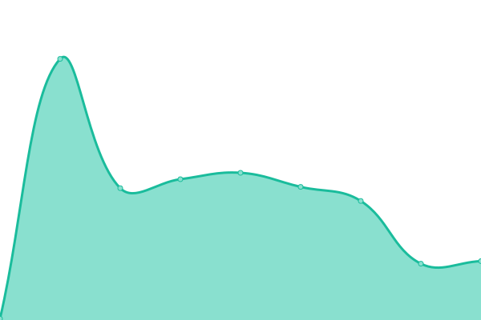

# [📈 Live Status](https://xxrjun.github.io/upptime): <!--live status--> **🟧 Partial outage**

This repository contains the open-source uptime monitor and status page for [rjun](https://xxrjun.github.io/upptime), powered by [Upptime](https://github.com/upptime/upptime).

With [Upptime](https://upptime.js.org), you can get your own unlimited and free uptime monitor and status page, powered entirely by a GitHub repository. We use [Issues](https://github.com/xxrjun/upptime/issues) as incident reports, [Actions](https://github.com/xxrjun/upptime/actions) as uptime monitors, and [Pages](https://xxrjun.github.io/upptime) for the status page.

<!--start: status pages-->
<!-- This summary is generated by Upptime (https://github.com/upptime/upptime) -->
<!-- Do not edit this manually, your changes will be overwritten -->
<!-- prettier-ignore -->
| URL | Status | History | Response Time | Uptime |
| --- | ------ | ------- | ------------- | ------ |
|  [Yahoo](https://tw.yahoo.com) | 🟩 Up | [yahoo.yml](https://github.com/xxrjun/upptime/commits/HEAD/history/yahoo.yml) | 

 630ms
     
 | 

<a href="https://xxrjun.github.io/upptime/history/yahoo">100.00%</a>
    

|  [Youtube](https://www.youtube.com/) | 🟩 Up | [youtube.yml](https://github.com/xxrjun/upptime/commits/HEAD/history/youtube.yml) | 

 228ms
     
 | 

<a href="https://xxrjun.github.io/upptime/history/youtube">100.00%</a>
    

|  [Global UDN News](https://global.udn.com/) | 🟩 Up | [global-udn-news.yml](https://github.com/xxrjun/upptime/commits/HEAD/history/global-udn-news.yml) | 

 412ms
     
 | 

<a href="https://xxrjun.github.io/upptime/history/global-udn-news">100.00%</a>
    

|  [National Central University](https://www.ncu.edu.tw/tw/index.html) | 🟩 Up | [national-central-university.yml](https://github.com/xxrjun/upptime/commits/HEAD/history/national-central-university.yml) | 

 2458ms
     
 | 

<a href="https://xxrjun.github.io/upptime/history/national-central-university">99.84%</a>
    

|  [Overreacted](https://overreacted.io/) | 🟩 Up | [overreacted.yml](https://github.com/xxrjun/upptime/commits/HEAD/history/overreacted.yml) | 

 142ms
     
 | 

<a href="https://xxrjun.github.io/upptime/history/overreacted">100.00%</a>
    

|  [Leetcode](https://leetcode.com/) | 🟥 Down | [leetcode.yml](https://github.com/xxrjun/upptime/commits/HEAD/history/leetcode.yml) | 

 178ms
     
 | 

<a href="https://xxrjun.github.io/upptime/history/leetcode">99.72%</a>
    

|  [Test Added Broken Site](https://thisisawebsitedoesnotexistaddedbyme.asjdnoi.xxjrun) | 🟥 Down | [test-added-broken-site.yml](https://github.com/xxrjun/upptime/commits/HEAD/history/test-added-broken-site.yml) | 

 0ms
     
 | 

<a href="https://xxrjun.github.io/upptime/history/test-added-broken-site">100.00%</a>
    

<!--end: status pages-->

[**Visit our status website →**](https://xxrjun.github.io/upptime)

## 📄 License

- Powered by: [Upptime](https://github.com/upptime/upptime)
- Code: [MIT](./LICENSE) © [rjun](https://xxrjun.github.io/upptime)
- Data in the `./history` directory: [Open Database License](https://opendatacommons.org/licenses/odbl/1-0/)
